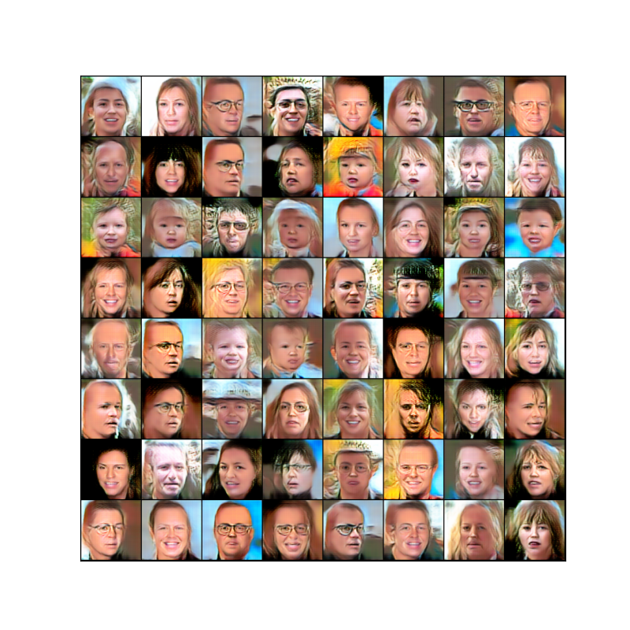

# OVERVIEW

The repository shows code for training DCGAN model, generating fake image face.

Several tricks were used during training:

- Label smoothing;
- Image buffer;
- Gaussian Noise added to Discriminator.

KNN algorithm was used to check similarity of fake and real images and based on that result accuracy was calculated.

To compare Fake and Real images distribution TSNE algorithm was used.

# Results

Accuracy calculated with KNN is 89 % (ideally supposed to be near 50 %)

Training logged metrics and images distribution:

  

Unstabilized generator loss and model inability to catch real image distribution indicates that model has not converged.

Fake image examples:

  

 